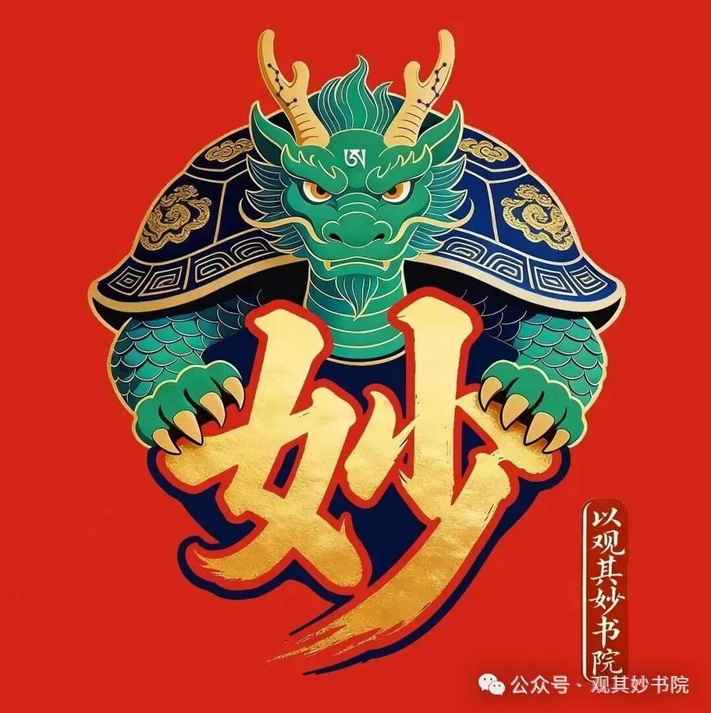

## 五行周复盘｜Week 01：从动物到食物，你的五行在说什么

---

### 本周一句话

**三只日签，三个维度，三种觉察——本周的修行，从"看见自己"开始。**

---

### 本周行为成功清单

**1. 动物日签（D001）：看见你的能量原型**
本周最成功的设计，是让读者通过"选动物"完成了一次零门槛的自我觉察。鹰/孔雀/熊猫/猎豹/海豚——五个选项背后不是标签，是五种生命策略的映照。读者不需要懂五行，只需要诚实选择，就已经踏上了觉察的第一步。

**2. 颜色日签（D002）：把觉察穿在身上**
衣柜比嘴巴诚实。本周成功将五行色（青赤黄白黑）与日常穿衣场景绑定，让读者从"我穿什么"看到"我需要什么能量"。火行的"悦己"转化路径——穿给自己，不是穿给别人——是本周最具穿透力的洞察。

**3. 食物日签（D003）：身体比脑子先知道**
压力饮食是最诚实的五行信号。本周成功将"压力大时想吃什么"与五味入五脏（酸苦甘辛咸对应肝心脾肺肾）打通，让读者理解：不是你在选食物，是你的臓腑在求救。

**4. B=MAP三维度覆盖**
本周三个修心练习恰好覆盖了B=MAP全链路：D001聚焦能力（A·80分做完就停）、D002聚焦动机（M·悦己而非悦人）、D003聚焦提示（P·伸手瞬间触发）。这是设计上的幸运，也是五行自然流动的结果。

---

### 本周行为失败分析（B=MAP诊断）

**问题：日签断更一天（5月27日缺席，5月30日缺席）**

这不是"忘了发"，是B=MAP链路上的信号。

**M（动机）诊断：不缺**
日签的动机锚定很清晰——每天帮读者做一次微小觉察。这个动机足够强，不是动力问题。

**A（能力）诊断：不缺**
生成一篇日签的技术门槛已经很低（题库+模板），不是能力问题。

**P（提示）诊断：断裂在这里**
断更发生在周二和周五——恰好是自动化调度中没有明确提示锚点的日期。周一/周四/周五的日签轨道在计划中，但"提示"依赖自动化定时触发，当系统未按时启动时，没有备用的人工检查机制。**提示是本周最薄弱的环节。**

**修复策略**：在 weekly-review 流程中增加一项——每周日复盘时，检查本周是否所有计划日签已发布。把"周复盘"本身变成下一周的计划锚点。

**另一个隐性失败：周三热点分析轨道未执行**
5月27日是周三，应执行热点分析轨道。但当天发布了热点文章《AI诈骗》——回头看这属于计划外执行，没有纳入三轨制统一管理。**热点轨道的选题和发布流程尚未标准化**，导致周三的内容质量无法保证稳定输出。

---

### 下周B=MAP设计

**M（动机微调）**：不变——"每天帮读者做一次微小觉察"仍然是核心动机。但增加一个次级动机："让读者在周复盘中感受到'这一周我有进步'"。

**A（能力微调）**：增加一道"安全网"——每次生成日签时，同时生成下周同一日期的草稿框架（仅标题+选题+核心洞察一句话）。降低每次启动的认知负荷。

**P（提示微调）**：
- 周一/二/四/五：自动化定时触发（保持）
- 周三：提前在周二日签文末加一句"明天是热点分析日，你想看什么话题？"——用读者互动作为热点选题的提示锚点
- 周日：周复盘本身成为下一周的"启动仪式"

---

### 龙龟手记

> 本周三只日签，恰好走完了一个微型的"觉察闭环"：动物（你是什么能量）→颜色（你穿什么能量）→食物（你用什么补偿能量）。这不是设计出来的巧合，是五行本身的流动——从识己到观行到察身，从外在到内在，从意识潜入身体。五行人格心理学不是让你"认识自己"然后停在那里，而是让你每一天都更诚实一点点。诚实，就是圆满人格的第一步。

---

*以观其妙书院*
*使命：以文载道，赋能超级个体*
*愿景：超级个体信赖的古今智慧融合平台*
*价值观：融古通今、观微知著、知行合一、妙启心智、博采精进*
*研究方向：企业文化、五行人格心理学、AI应用、象思维及思想模型、心文化*

**找到我们**

添加姜老师微信：13224763245（电话微信同步，备注：五行测评）

扫码加入知识星球：

